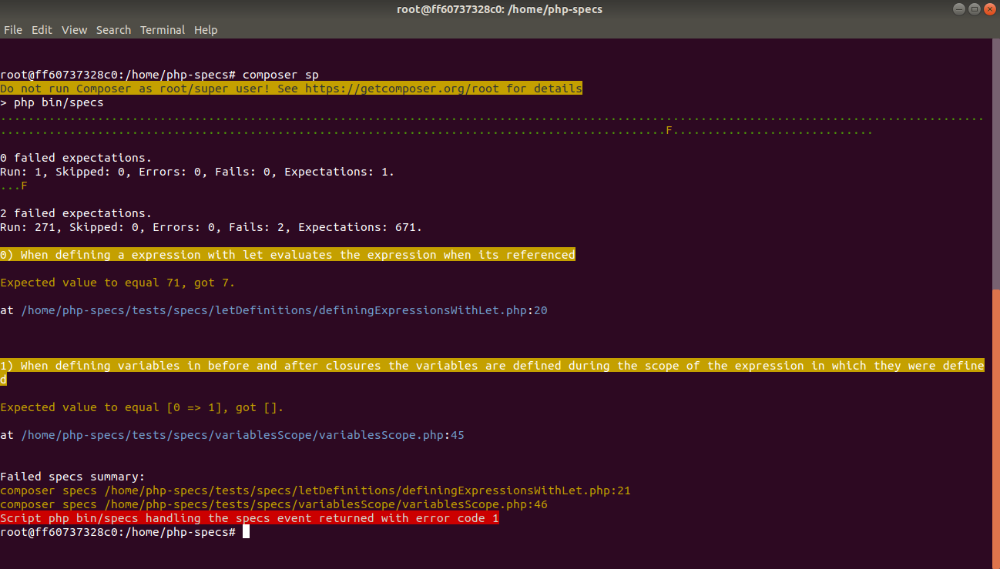

# Haijin Specs

A testing framework that uses a simple DSL, inspired by RSpec.

[](https://packagist.org/packages/haijin/specs)
[](https://travis-ci.org/haijin-development/php-specs)
[](https://packagist.org/packages/haijin/specs)

### Version 2.0.0

If you like it a lot you may contribute by [financing](https://github.com/haijin-development/support-haijin-development) its development.

## Table of contents

1. [Installation](#c-1)
2. [Usage](#c-2)
    1. [Spec definitions](#c-2-1)
    2. [Built-in expectations](#c-2-2)
        1. [expect( $object ) ->to() ->be() ->like(...)](#c-2-2-1)
        2. [expect( $object ) ->to() ->be() ->exactlyLike(...)](#c-2-2-2)
    3. [Specs structure](#c-2-3)
    4. [Evaluating code before and after running expectations](#c-2-4)
    5. [Defining values with let(...) expressions](#c-2-5)
    6. [Defining methods with def(...)](#c-2-6)
    7. [Defining custom expectations](#c-2-7)
        1. [Expectation definition structure](#c-2-7-1)
        2. [Getting the value being validated](#c-2-7-2)
        3. [Parameters of the definition closures](#c-2-7-3)
        4. [Raising expectation errors](#c-2-7-4)
        5. [Evaluating closures within custom expectations](#c-2-7-5)
        6. [Complete example](#c-2-7-6)
    8. [Temporary skipping a spec](#c-2-8)
    9. [Factorizing and reusing specs behaviour](#c-2-9)
    10. [Running the specs from the command line](#c-2-10)
    11. [Generating a coverage report](#c-2-11)
3. [Running this project tests](#c-3)

<a name="c-1"></a>
## Installation

Include this library in your project `composer.json` file:

```json
{
    ...

    "require-dev": {
        ...
        "haijin/specs": "^2.0",
        ...
    },

    ...
}
```

<a name="c-2"></a>
## Usage

In the project folder run

```
composer install

php ./vendor/bin/specs init
```

This will create a directory named `tests/specs` and a `specsBoot.php` file.

In any nested subdirectory of `tests/specs` create files with specs definitions. No naming convention is needed for these files, all of them will be considered spec files.

`tests/specsBoot.php` is an optional regular PHP script file loaded before any other spec file and can be used to customize the specs runner.

<a name="c-2-1"></a>
### Spec definitions

A spec file contains expectations on a feature or functionality.

A spec file looks like this:

```php
<?php

$spec->describe( "When formatting a user's full name", function() {

    $this->it( "appends the user's last name to the user's name", function() {

        $user = new User( "Lisa", "Simpson" );

        $this->expect( $user->getFullName() ) ->to() ->equal( "Lisa Simpson" );

    });

});
```

<a name="c-2-2"></a>
### Built-in expectations

Expectations are the equivalent to the assertions used in PHPUnit.

A expectation has two main parts, the value on which the expectation is expressed, for instance a string with the user's full name:

```php
$this->expect( $user->getFullName() )
```

and the expectations on that value:

```php
->to() ->equal('Lisa Simpson');
```

Specs library comes with the most common expectations built-in:

```php
// Comparison expectations

$this->expect( $value ) ->to() ->equal( $anotherValue );
$this->expect( $value ) ->to() ->be( ">" ) ->than( $anotherValue );
$this->expect( $value ) ->to() ->be( "===" ) ->than( $anotherValue );
$this->expect( $value ) ->to() ->be() ->null();
$this->expect( $value ) ->to() ->be() ->true();
$this->expect( $value ) ->to() ->be() ->false();
$this->expect( $value ) ->to() ->be() ->like([
    "name" => "Lisa",
    "lastName" => "Simpson",
    "address" => [
        "streetName" => "Evergreen",
        "streetNumber" => 742
    ]
]);
$this->expect( $value ) ->to() ->be() ->exactlyLike([
    "name" => "Lisa",
    "lastName" => "Simpson",
    "address" => [
        "streetName" => "Evergreen",
        "streetNumber" => 742
    ]
]);

// Types expectations

$this->expect( $value ) ->to() ->be() ->string();
$this->expect( $value ) ->to() ->be() ->int();
$this->expect( $value ) ->to() ->be() ->double();
$this->expect( $value ) ->to() ->be() ->number();
$this->expect( $value ) ->to() ->be() ->bool();
$this->expect( $value ) ->to() ->be() ->array();
$this->expect( $value ) ->to() ->be() ->a( SomeClass::class );
$this->expect( $value ) ->to() ->be() ->instanceOf( SomeClass::class );

// String expectations

$this->expect( $stringValue ) ->to() ->beginWith( $substring );
$this->expect( $stringValue ) ->to() ->endWith( $substring );
$this->expect( $stringValue ) ->to() ->contain( $substring );
$this->expect( $stringValue ) ->to() ->match( $regexp );
$this->expect( $stringValue ) ->to() ->match( $regexp, function($matched) {
    // further expectations on the $matched elements, for instance:
    $this->expect( $matched[1] ) ->to() ->equal(...) ;
});

// Array expectations

$this->expect( $arrayValue ) ->to() ->include( $value );
$this->expect( $arrayValue ) ->to() ->includeAll( $values );
$this->expect( $arrayValue ) ->to() ->includeAny( $values );
$this->expect( $arrayValue ) ->to() ->includeNone( $values );
$this->expect( $arrayValue ) ->to() ->includeKey( $key );
$this->expect( $arrayValue ) ->to() ->includeKey( $key, funtion($value) {
    // further expectations on the $value, for instance:
    $this->expect( $value ) ->to() ->equal(...) ;
});
$this->expect( $arrayValue ) ->to() ->includeValue( $value );

// File expectations

$this->expect( $filePath ) ->to() ->be() ->aFile();
$this->expect( $filePath ) ->to() ->haveFileContents( function($contents) {
    // further expectations on the $contents, for instance:
    $this->expect( $contents ) ->to() ->match(...) ;
});

$this->expect( $filePath ) ->to() ->be() ->aDirectory();
$this->expect( $filePath ) ->to() ->haveDirectoryContents( function($files, $filesBasePath) {
    // further expectations on the $files
});

// Exceptions

$this->expect( function() {

    throw Exception();

}) ->to() ->raise( Exception::class );


$this->expect( function() {

        throw Exception( "Some message." );

}) ->to() ->raise( Exception::class, function($e) {
    // further expectations on the Exception instance, for instance:
    $this->expect( $e->getMessage() ) ->to() ->equal(...);        

});
```

Most expectations can also be negated with

```php
$this->expect( $value ) ->not() ->to() ->equal( $anotherValue );

$this->expect( function() {

    throw Exception();

}) ->not() ->to() ->raise( Exception::class );
```

<a name="c-2-2-1"></a>
#### expect( $object ) ->to() ->be() ->like(...)

The expectation `expect( $object ) ->to() ->be() ->like(...)` evaluates nested expectations on arrays, associative arrays, objects and any mix of them.

Example:

```php

$user = [
    'name' => "Lisa",
    'lastName' => "Simpson",
    'address' => [
        'streetName' => "Evergreen",
        'streetNumber' => 742
    ],
    'ignoredAttribute' => ""
];

$this->expect( $user ) ->to() ->be() ->like([
    'name' => "Lisa",
    'lastName' => "Simpson",
    'address' => [
        'streetName' => "Evergreen",
        'streetNumber' => 742
    ]
]);
```

It also works with getter functions:

```php
$this->expect( $user ) ->to() ->be() ->like([
    'getName()' => "Lisa",
    'getLastName()' => "Simpson",
    'getAddress()' => [
        'getStreetName()' => "Evergreen",
        'getStreetNumber()' => 742
    ]
]);
```

The expectation uses equality (`==`) to compare values. To use a custom expectation on a single value use a closure:

```php
$this->expect( $user ) ->to() ->be() ->like([
    'getName()' => function($value) { $this->expect( $value ) ->not() ->to() ->be() ->null(); },
    'getLastName()' => "Simpson",
    'getAddress()' => [
        'getStreetName()' => "Evergreen",
        'getStreetNumber()' => 742
    ]
]);
```

<a name="c-2-2-2"></a>
#### expect( $object ) ->to() ->be() ->exactlyLike(...)

Same as `expect( $object ) ->to() ->be() ->like(...)` but if the object is an array and has more or less attributes than the expected value the expectation fails.


<a name="c-2-3"></a>
### Specs structure

A spec begins with a `$spec->decribe(...)` statement, and can include any number of additional nested `$this->describe()` statements. Each `describe()` statement documents a group of expectations that are somehow related, for instance because they declare different expected behaviours for the same functionality.

The `->it(...)` statement is where expectations are declared.

```php
$spec->describe( "When formatting a user's full name", function() {

    $this->describe( "with both name and last name defined", function() {

        $this->it( "appends the user's last name to the user's name", function() {

            $user = new User( "Lisa", "Simpson" );

            $this->expect( $user->getFullName() ) ->to() ->equal( "Lisa Simpson" );

        });

    });

    $this->describe( "with the name undefined", function() {

        $this->it( "returns only the last name", function() {

            $user = new User( "", "Simpson" );

            $this->expect( $user->getFullName() ) ->to() ->equal( "Simpson" );

        });

    });

    $this->describe( "with the last name undefined", function() {

        $this->it( "returns only the name", function() {

            $user = new User( "Lisa", "" );

            $this->expect( $user->getFullName() ) ->to() ->equal( "Lisa" );

        });

    });
});
```

<a name="c-2-4"></a>
### Evaluating code before and after running expectations

To evaluate statements before and after each spec is run use `beforeEach($closure)` and `afterEach($closure)` at any `describe` statement.
They are the equivalent to `setUp()` and `tearDown()` function on `TestCase`.

```php
$spec->describe( "When formatting a user's full name", function() {

    $this->beforeEach( function() {
        $this->n = 0;
    });

    $this->afterEach( function() {
        $this->n = null;
    });

    $this->describe( "with both name and last name defined", function() {

        $this->beforeEach( function() {
            $this->n += 1;
        });

        $this->afterEach( function() {
            $this->n -= 1;
        });


        $this->it( "...", function() {
            print $this->n;
        });

    });

});
```

To evaluate statements before and after all the specs of a `describe` statement are run use `beforeAll($closure)` and `afterAll($closure)` statements:

```php
$spec->describe( "When formatting a user's full name", function() {

    $this->beforeAll( function() {
        $this->n = 0;
    });

    $this->afterAll( function() {
        $this->n = null;
    });

    $this->describe( "with both name and last name defined", function() {

        $this->beforeAll( function() {
            $this->n += 1;
        });

        $this->afterAll( function() {
            $this->n -= 1;
        });


        $this->it( "...", function() {
            print $this->n;
        });

    });

});
```

To evaluate statements before and after any spec is run, like establishing connections to databases, creating tables or creating complex folder structures, or before and after each single statement, create or add to the `tests/specsBoot.php` file the following configuration:

```php
// tests/specsBoot.php

$specs->beforeAll( function() {

});

$specs->afterAll( function() {

});

$specs->beforeEach( function() {

});

$specs->afterEach( function() {

});
```


It is possible to use and mix multiple `beforeAll`, `afterAll`, `beforeEach` and `afterEach` at any level.

<a name="c-2-5"></a>
### Defining values with let(...) expressions

Define expressions and constants using the `let( $expressionName, $closure )` statement.

Using `$this->let()` is similar to the initialization of instance variables during the `setUp()` method in `TestCase`.

Expressions defined with `let(...)` are lazily evaluated the first time they are referenced by each spec.

`let(...)` expressions are inherit by child `describe(...)` specs and can be safely overridden within the scope of a child `describe(...)`.

A `let(...)` expression can reference another `let(...)` expression.

Example:

```php
$spec->describe( "When searching for users", function() {

    $this->let( "userId", function() {
        return 1;
    });

    $this->it( "finds the user by id", function(){

        $user = Users::findById( $this->userId );

        $this->expect( $user ) ->not() ->to() ->beNull();

    });

    $this->describe( "the retrieved user data", function() {

        $this->let( "user", function() {
            return Users::findById( $this->userId );
        });

        $this->it( "includes the name", function() {

            $this->expect( $this->user->getName() ) ->to() ->equal( "Lisa" );

        });

        $this->it( "includes the lastname", function() {

            $this->expect( $this->user->getLastname() ) ->to() ->equal( "Simpson" );

        });

    });

});
```

It is also possible to define named expressions at a global level in the `specsBoot.php` file, but keep in mind that that will make each spec less expressive and will make it more difficult to understand:

```php
// tests/specsBoot.php

$specs->let( "userId", function() {
    return 1;
});
```
<a name="c-2-6"></a>
### Defining methods with def(...)

Define methods using the `def($methodName, $closure)` statement.

The behaviour and scope of the methods is the same as for `let(...)` expressions.

Example:

```php
$spec->describe( "...", function() {

    $this->def( "sum", function($n, $m) {
        return $n + $m;
    });

    $this->it( "...", function(){

        $this->expect( $this->sum( 3, 4 ) ->to() ->equal( 7 );

    });

});
```

<a name="c-2-7"></a>
### Defining custom expectations

<a name="c-2-7-1"></a>
#### Expectation definition structure

A expectation definition has 4 parts, each part defined with a closure.

The first one is the `$this->before($closure)` closure. This closure is evaluated before evaluating an expectation on a value. This block is optional but it can be used to perform complex calculations needed by the expectations for both the assertive and the negated closures.

The second one is the `$this->assertWith($closure)` closure. This closure is evaluated to evaluate a positive expectation on a value.

The third one is the `$this->negateWith($closure)` closure. This closure is evaluated to evaluate a negated expectation on a value.

The fourth one is the `$this->after($closure)` closure. This closure is evaluated after the expectation is run, even when an ExpectationFailure was raised. This closure is optional but it can be used to release resources allocated during the evaluation of the previous closures.

<a name="c-2-7-2"></a>
#### Getting the value being validated

To get the value being validated use `$this->actualValue`.

<a name="c-2-7-3"></a>
#### Parameters of the definition closures

The parameters of the 4 closures are the ones passed to the expectation in the Spec. For instance, if the spec is declared as

```php
$this->expect( 1 ) ->not() ->to() ->equal( 2 );
```

the parameters for the 4 closures of the the `equal` expectation will be the expected value `2`:

```php
$this->before( function($expectedValue) {
});

$this->assertWith( function($expectedValue) {
});

$this->negateWith( function($expectedValue) {
});

$this->after( function($expectedValue) {
});
```

<a name="c-2-7-4"></a>
#### Raising expectation errors

To raise an expectation failure use `$this->raiseFailure($failureMessage)`.

<a name="c-2-7-5"></a>
#### Evaluating closures within custom expectations

The validated value or some of the expectation parameters may be closures.

To evaluate closures within a custom expectation definition use `evaluateClosure($closure, ...$params)`.

This is required for the closure to evaluate with the proper binding.

Example:

```php
Value_Expectations::defineExpectation( "customExpectation", function() {

    $this->assertWith( function($expectedClosure) {

        $this->evaluateClosure( $expectedClosure, $this->actualValue );

        // ...
    });
);
```

<a name="c-2-7-6"></a>
#### Complete example

Here is a complete example of a custom validation:

```php

Value_Expectations::defineExpectation( "equal", function() {

    $this->before( function($expectedValue) {
        $this->gotExpectedValue = $expectedValue == $this->actualValue;
    });

    $this->assertWith( function($expectedValue) {

        if( $this->gotExpectedValue ) {
            return;
        }

        $this->raiseFailure(
            "Expected value to equal {$expectedValue}, got {$this->actualValue}."
        );
    });

    $this->negateWith( function($expectedValue) {

        if( ! $this->gotExpectedValue ) {
            return;
        }

        $this->raiseFailure(
            "Expected value not to equal {$expectedValue}, got {$this->actualValue}."
        );
    });

    $this->after( function($expectedValue) {
    });
});
```

<a name="c-2-8"></a>
#### Temporary skipping a spec

To temporary skip a spec or a group of specs prepend an `x` to its definition:

```php
$spec->describe( "When searching for users", function() {

    $this->let( "userId", function() {
        return 1;
    });

    $this->xit( "finds the user by id", function(){

        $user = Users::findById( $this->userId );

        $this->expect( $user ) ->not() ->to() ->beNull();

    });

    $this->xdescribe( "the retrieved user data", function() {

        $this->let( "user", function() {
            return Users::findById( $this->userId );
        });

        $this->it( "includes the name", function() {

            $this->expect( $this->user->getName() ) ->to() ->equal( "Lisa" );

        });

        $this->it( "includes the lastname", function() {

            $this->expect( $this->user->getLastname() ) ->to() ->equal( "Simpson" );

        });

    });

});
```


<a name="c-2-9"></a>
#### Factorizing and reusing specs behaviour

To reuse custom specs methods and properties define them in a static function of a class:

```php
class HtmlSpecsMethods {

    static public function addTo($spec)
    {
        $spec->def( "navigateTo", function($requestUri) {
            /// ...
        });

        $spec->def( "clickLink", function($id) {
            /// ...
        });

    }

}
```

and include the methods with:


```php
// tests/specsBoot.php


HtmlSpecsMethods::addTo( $specs );
```

<a name="c-2-10"></a>
#### Running the specs from the command line

Run all specs with:

```
php ./vendor/bin/specs
```

or add to the `composer.json` of the project the line:

```json
"scripts": {
    "specs": "php ./vendor/bin/specs"
}
```

and then run the specs with

```
composer specs
```


Run all the specs in a single file or folder with:

```
composer specs tests/specs/variables-scope/variables-scope.php
```

Run a single spec at a line number with:

```
composer specs tests/specs/variables-scope/variables-scope.php:49
```

The line number must be in the scope of the spec.

When specs are run from the command line failures are logged with the file name and line number in the same format the runner expects to run that single spec:



To run a single failing spec copy the failing spec line from the console summary and paste it in a new command:

```
composer specs /home/php-specs/tests/specs/variablesScope/variablesScope.php:49
```

<a name="c-2-11"></a>
#### Generating a coverage report

To generate an html report of the tests code coverage follow these steps:

##### Install the PHP debugging tool of your preference.

Such as [xdebug](https://xdebug.org/).

The Docker image `haijin/php-dev:7.2` has xdebug installed already.

##### Add the `php-code-coverage` package to the dev requirements of the project.

In the project `composer.json` file add:

```json
 "require-dev": {
  ...
  "phpunit/php-code-coverage": "^7.0"
  ...
},
``` 

##### Initialize `php-code-coverage` before evaluating the specs.

In the `tests/specsBoot.php` file add:


```php
// tests/specsBoot.php
declare(strict_types=1);

use SebastianBergmann\CodeCoverage\CodeCoverage;
use SebastianBergmann\CodeCoverage\Report\Html\Facade;

$specs->beforeAll( function() {
    $this->coverage = initializeCoverageReport();
});

$specs->afterAll( function() {
    generateCoverageReport($this->coverage);
});

function initializeCoverageReport()
{
    $coverage = new CodeCoverage;
    $coverage->filter()->addDirectoryToWhitelist('src/');
    $coverage->start('specsCoverage');

    return $coverage;
};

function generateCoverageReport($coverage)
{
    $coverage->stop();
    $writer = new Facade;
    $writer->process($coverage, 'coverage-report/');
};
```

This will leave an HTML coverage report in the project folder `coverage-report/`.

<a name="c-3"></a>
## Running this project tests

To run the tests of this project do:

```
composer specs
```

Or if you want to run the tests using a Docker image with PHP 7.2:

```
sudo docker run -ti -v $(pwd):/home/php-specs --rm --name php-specs haijin/php-dev:7.2 bash
cd /home/php-specs/
composer install
composer specs
```